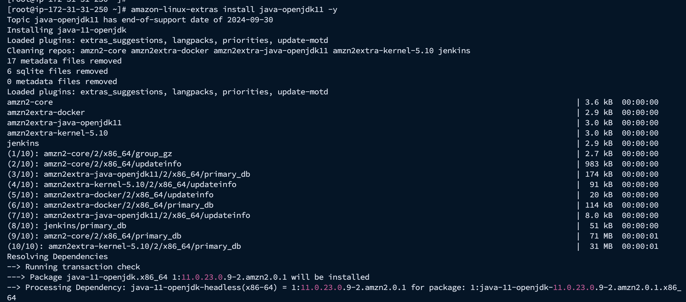

**Jenkins Installation on EC2 in AWS**

 

**Step 1: Connect to Your EC2 Instance**

First, SSH into your EC2 instance:

*ssh -i your-key.pem ec2-user@your-ec2-public-ip*

**Step 2: Switch to Root User**

Gain root access by switching to the root user:

*sudo su -*

**Step 3: Add the Jenkins Repository**

Download the Jenkins repository configuration file to your yum.repos.d directory:

*sudo wget -O /etc/yum.repos.d/jenkins.repo https://pkg.jenkins.io/redhat-stable/jenkins.repo*

Import the Jenkins repository key:

*sudo rpm --import https://pkg.jenkins.io/redhat-stable/jenkins.io-2023.key

**Step 4: Install Java 11**

Jenkins requires Java. Install OpenJDK 11:

*amazon-linux-extras install java-openjdk11 -y*

**Step 5: Install Jenkins**

Once Java is installed, you can proceed to install Jenkins:

*yum install jenkins -y*

**Step 6: Start and Enable Jenkins Service**

To ensure that Jenkins starts on boot, enable it using systemd and start the service:

*systemctl enable jenkins*
*systemctl start jenkins*
systemctl status jenkins*
You should see Jenkins active and running.

**Step 7: Open Jenkins in Your Browser**

By default, Jenkins runs on port 8080. Open your web browser and go to:

*http://your-ec2-public-ip:8080*

**Step 8: Retrieve Initial Admin Password**

To unlock Jenkins, you will need the initial admin password. You can find it in the following file:

*cat /var/lib/jenkins/secrets/initialAdminPassword*
Copy the password and paste it into the Jenkins setup page.

This completes the Jenkins installation on an EC2 instance. You can further configure Jenkins by installing the necessary plugins and setting up your desired projects.