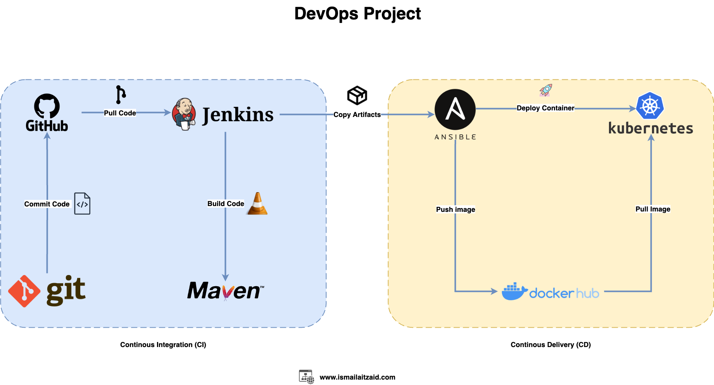

# **DevOps Project - CI/CD Pipeline**

This project demonstrates a **Continuous Integration (CI)** and **Continuous Delivery (CD)** pipeline using **Git**, **GitHub**, **Jenkins**, **Maven**, **Ansible**, **Docker Hub**, and **Kubernetes**.

## **Overview**

This CI/CD pipeline automates the process of **building**, **testing**, and **deploying** applications, enabling seamless integration and deployment across various environments. The pipeline integrates **GitHub** for version control, **Jenkins** for automating builds, **Maven** for building the code, **Ansible** for deployment, and **Kubernetes** for container orchestration.



---

## **Pipeline Components**

### **Continuous Integration (CI)**
1. **Git**: 
   - Developers **commit** code to a **GitHub** repository.
   - Jenkins is triggered to pull the latest code from the repository.

2. **GitHub**:
   - **Pull Requests** are created and merged into the main branch, which triggers the Jenkins pipeline.

3. **Jenkins**:
   - Jenkins **pulls code** from **GitHub**.
   - Jenkins **builds** the code using **Maven**.
   - Artifacts are stored for later stages in the pipeline.

4. **Maven**:
   - Maven is used to **build** and **package** the application. It ensures that all dependencies are resolved and that the application is ready for deployment.

**Continuous integration** allows for the early detection of issues and provides feedback to developers, ensuring that new code integrates seamlessly into the existing codebase.

---

### **Continuous Delivery (CD)**
1. **Ansible**:
   - Ansible automates the deployment process by **copying artifacts** generated by Jenkins to the target environment.
   - Ansible pushes Docker images to **Docker Hub** and triggers Kubernetes to deploy the updated containers.

2. **Docker Hub**:
   - Docker Hub stores Docker images that are built during the CI process. These images are pushed to Docker Hub, which acts as a central registry for the application's container images.

3. **Kubernetes**:
   - Kubernetes **pulls Docker images** from Docker Hub and deploys the application to the desired environment.
   - The application is managed in containers, ensuring scalability and reliability in production.

**Continuous Delivery** ensures that the application is always ready to be deployed to production, and **Kubernetes** ensures the application is deployed in a containerized environment, providing high availability and scalability.

---

## **Workflow Explanation**

1. **Commit Code**: 
   Developers write and commit code to the GitHub repository.

2. **Pull Code**:
   Jenkins is configured to automatically trigger builds when there is a new commit or pull request merged into the repository.

3. **Build Code**:
   Jenkins pulls the code and uses **Maven** to compile and build the code. Once the build is successful, the generated artifacts (such as Docker images) are stored.

4. **Copy Artifacts**:
   The artifacts are copied to the deployment server using **Ansible**. This process is automated to ensure fast and reliable delivery.

5. **Push Image**:
   The built Docker image is pushed to **Docker Hub**, making it available for deployment.

6. **Deploy Container**:
   **Ansible** triggers the deployment of containers on **Kubernetes**. The Docker images are pulled from Docker Hub, and Kubernetes orchestrates the deployment of the containers.

---

## **Key Technologies Used**

- **Git**: Version control system used for tracking changes in the source code.
- **GitHub**: Git repository hosting service used for collaborative development.
- **Jenkins**: Automation server used to build, test, and deploy applications.
- **Maven**: Build automation tool used primarily for Java projects.
- **Ansible**: Automation tool for configuration management and application deployment.
- **Docker Hub**: Cloud-based registry that stores Docker images.
- **Kubernetes**: Container orchestration platform for automating the deployment, scaling, and management of containerized applications.

---

## **How to Use This Project**

1. **Clone the Repository**:
   ```bash
   git clone https://github.com/ITMan-1/devops_project.git
